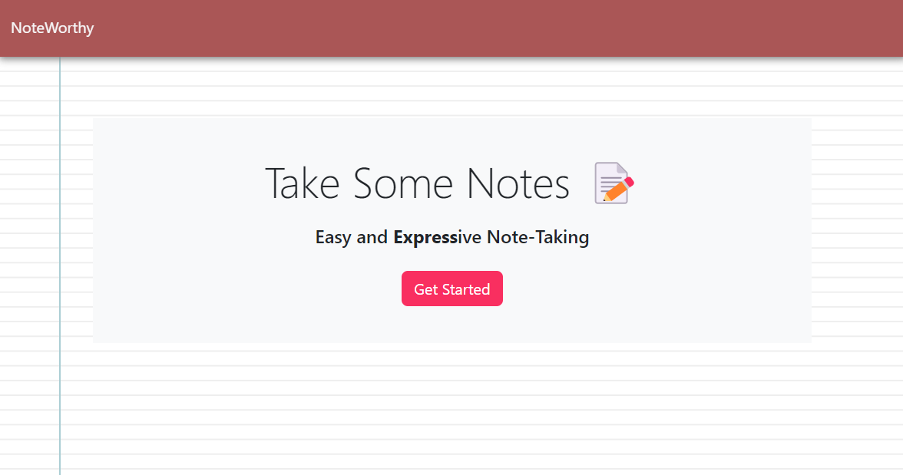
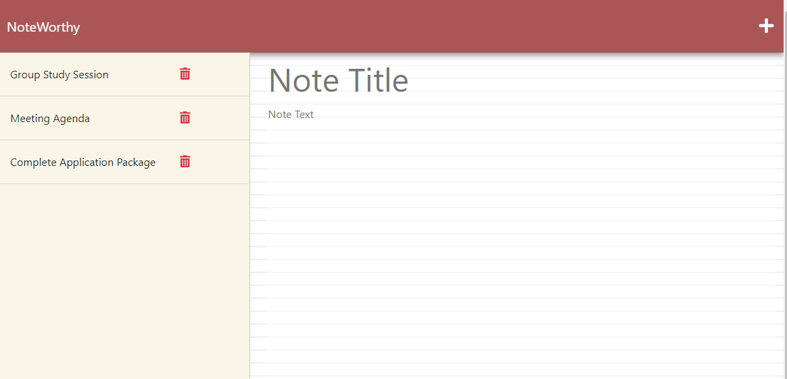
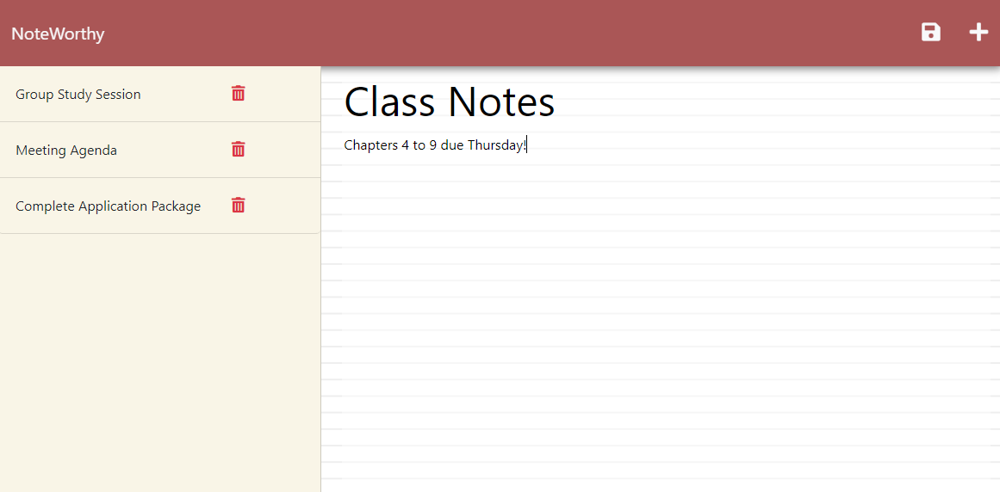

# NoteWorthy -Express.js Note Taking Application
  > Module 11 Challenge - Express.js: Note Taker
  
  [](https://opensource.org/licenses/MIT)

  ## Description
  NoteWorthy is a simple and efficient note taker application designed to help the user organize their thoughts and keep track of essential tasks. This project involves building the back end of the application using Express.js and connecting it with the existing front end. The ultimate goal is to create a seamless user experience that allows users to write, save, and retrieve notes effortlessly.

  ### [Click here to check the deployed Application ➡️](https://noteworthy-note-taking-app-32b863478a35.herokuapp.com/)<br><br>

  
  
  
  
  
  

  ## Table of Contents
  * [Screenshots](#screenshots)
  * [Installation](#installation)
  * [Usage](#usage)
  * [Contributing](#contributing)
  * [License](#license)
  * [Questions](#questions)

 ## Screenshots




  ## Installation
 Clone the repository:

```sh
git clone https://github.com/CypherNyx/NoteWorthy.git
```

Install the required dependencies:

```sh
npm install
```

Run the project in your local browser:

```sh
npm start
```

  ## Usage
  To use this Note-Taking application:

 1. Click the link to access the notes page.
 2. Write a new note and click the Save icon.
 3. To view an existing note, click on it.
 4. To delete a note, click the red trash can button.

  ## Contributing
  

  ## License
  [](https://opensource.org/licenses/MIT)
  
  https://opensource.org/licenses/MIT 
    

  ## Questions
  GitHub [CypherNyx](https://github.com/CypherNyx)<br>
  Email: dguido.dev@gmail.com

